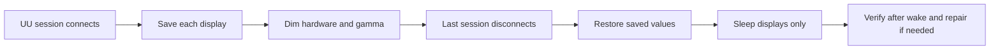

# UU Remote Brightness Guard

[简体中文](README.md)

[](https://github.com/zpmdd/uuremote-brightness-guard/actions/workflows/test.yml)
[](LICENSE)
[](#requirements)

A small macOS LaunchAgent that automatically dims every display when this Mac becomes the controlled side of a UU Remote session. After the last session disconnects, it restores each display's previous brightness and then sleeps the displays without sleeping the Mac.

> This project directly controls display brightness and gamma. Read [Safety and recovery](#safety-and-recovery) before enabling it, especially if you use external DDC/CI monitors.

## Features

- Detects real UU Remote connect/disconnect events from the local server log.
- Saves brightness separately for the built-in display and every external display.
- Dims external monitors to hardware 0% through DDC/CI, then holds their gamma at 0 for a near-black physical output.
- Restores the captured values after the final session disconnects, with a two-second debounce for connection glitches.
- Uses a safe fallback when a display's original value cannot be read: MonitorControl-style 85%, mapped to 70% raw DDC for external displays.
- When MonitorControl is installed and running, pauses it only while brightness is being changed, preventing its synchronization loop from overwriting per-display values.
- Handles stale state after a Mac or monitor restart and retries a failed restore.
- Sleeps only the displays one second after a successful disconnect restore, then verifies hardware brightness and gamma after wake and automatically repairs any mismatch.
- Runs locally, without `sudo`, accounts, cloud services, or network requests.



## Requirements

- An Apple Silicon Mac. Intel Macs are not supported by the current DDC service discovery code.
- [UU Remote](https://uuyc.163.com/) installed as `/Applications/UURemote.app`.
- [MonitorControl](https://github.com/MonitorControl/MonitorControl) is optional for a built-in-display-only Mac. It is strongly recommended with external displays so you can verify DDC/CI support and recover brightness manually if needed.
- External monitors with DDC/CI enabled. Some docks, adapters, or monitor inputs may block DDC/CI.
- Xcode Command Line Tools, used once to compile the local Swift helper. Install them with `xcode-select --install`.

The initial release was validated on Apple Silicon with macOS 26.5.2, UU Remote 4.34.0, MonitorControl 4.3.3, one built-in display, and two Dell U2720QM displays. Other versions and display topologies are currently unverified.

## Quick start

### Download and double-click

1. Download [UURemoteBrightnessGuard.zip](https://github.com/zpmdd/uuremote-brightness-guard/releases/latest/download/UURemoteBrightnessGuard.zip) from the latest release and extract it.
2. Make sure UU Remote is in `/Applications`. If you use external displays, installing MonitorControl is strongly recommended.
3. Double-click `Install.command`. If macOS blocks it, right-click the file and choose **Open**, or use the Terminal method below.

### Terminal

```bash
git clone https://github.com/zpmdd/uuremote-brightness-guard.git
cd uuremote-brightness-guard
./install.sh
```

Installation is per-user and does not require administrator access. The runtime is copied to:

```text
~/Library/Application Support/UURemoteBrightnessGuard
```

The downloaded source folder can be moved or deleted after installation. Open the installed folder in Finder to use `Status.command`, `Restore.command`, or `Uninstall.command`.

## Installed controls

| Control | Purpose |
| --- | --- |
| `Status.command` | Show active UU sessions, brightness state, LaunchAgent state, and the latest local events. |
| `Restore.command` | Stop the guard briefly, restore the saved values or the 85%/70% fallback, then re-enable it. |
| `Uninstall.command` | Restore first when necessary, unload the agent, and remove the installed runtime. |

The LaunchAgent label is `io.github.zpmdd.uuremote-brightness-guard`. Logs are stored in `~/Library/Logs/UURemoteBrightnessGuard`. Uninstall keeps logs by default; `./uninstall.sh --purge` removes them too.

## Safety and recovery

Before relying on the guard, confirm that MonitorControl can change every external monitor through DDC/CI. Test one connect/disconnect cycle while you can still access the Mac locally.

If a monitor stays dark after a crash, restart, or topology change:

1. Wake the displays with a key or mouse movement.
2. Open `~/Library/Application Support/UURemoteBrightnessGuard` in Finder.
3. Run `Restore.command`. It restores the saved snapshot when available; otherwise it applies the 85% built-in / 70% raw-DDC fallback.

You can also run:

```bash
"$HOME/Library/Application Support/UURemoteBrightnessGuard/restore.sh"
```

Do not disconnect, power-cycle, or rearrange monitors while testing an active dimmed session unless you have another way to reach the Mac. The project uses private macOS display APIs, so a future macOS update may require changes.

## How it works

The Python guard follows UU Remote's local `UURemoteServer.log` and tracks `peerConnected` / `disconnected` transitions by session handle. It ignores events from a previous boot or server process. MonitorControl is not called to change brightness; when present, its process is paused briefly only to avoid conflicting writes.

The Swift helper uses:

- `DisplayServices` for built-in display brightness;
- DDC/CI VCP code `0x10` for external hardware brightness;
- CoreGraphics gamma tables for the final near-black output and exact gamma restoration.

When display sleep is enabled, the guard retains the snapshot and listens for macOS display sleep/wake events. Four seconds after wake it reads built-in brightness, external DDC values, and external gamma tables. If MonitorControl shows the expected percentage while the picture is still too dark, the guard reapplies the snapshot and verifies again. Failed verification is retried every three seconds.

The snapshot and state files use mode `0600` and contain brightness values and transient display identifiers only. They do not store display names, serial numbers, UU accounts, remote device IDs, or network addresses. Without display sleep the snapshot is deleted after restoration; with display sleep it is deleted only after successful post-wake verification.

## Configuration

Defaults live in `launchd/io.github.zpmdd.uuremote-brightness-guard.plist`:

| Variable | Default | Meaning |
| --- | ---: | --- |
| `UURBG_DIM_FACTOR` | `0.0` | Gamma factor during a remote session. |
| `UURBG_DISCONNECT_GRACE` | `2.0` | Seconds to wait before restore after the last disconnect. |
| `UURBG_FALLBACK` | `0.85` | Built-in/combined fallback when the original value is unavailable. |
| `UURBG_DDC_FALLBACK` | `0.70` | Raw external DDC fallback corresponding to combined 85% in the tested MonitorControl setup. |
| `UURBG_SLEEP_AFTER_DISCONNECT` | `true` | Sleep displays after a successful disconnect restore. |
| `UURBG_DISPLAY_SLEEP_DELAY` | `1.0` | Delay before `pmset displaysleepnow`. |
| `UURBG_POST_WAKE_DELAY` | `4.0` | Delay after a display wake event before verification. |
| `UURBG_POST_WAKE_RETRY` | `3.0` | Retry interval after unsuccessful post-wake verification or repair. |

Advanced users can edit these string values in the template and rerun `./install.sh`. Values are clamped by the guard where appropriate.

## Development

```bash
make lint
make test
make build
```

The display helper uses macOS private frameworks and is compiled locally rather than committed as an unsigned binary. Pull requests are welcome; see [CONTRIBUTING.md](CONTRIBUTING.md).

## Limitations

- Apple Silicon only in the current release.
- UU Remote log formats are not a public API and may change.
- DDC/CI behavior depends on the monitor, input, cable, dock, and macOS release.
- External displays are matched by the runtime topology/slot order because the low-level service does not expose a stable public identifier.
- MonitorControl is not required for a built-in-only setup. External-display use without it is possible but has less convenient compatibility testing and manual recovery.
- This is an independent utility, not an official UU Remote or MonitorControl feature.

## License and acknowledgements

This project is licensed under the [MIT License](LICENSE).

The DDC implementation follows ideas and patterns from the MIT-licensed [MonitorControl](https://github.com/MonitorControl/MonitorControl) project. See [THIRD_PARTY_NOTICES.md](THIRD_PARTY_NOTICES.md) and [LICENSE-MonitorControl.txt](LICENSE-MonitorControl.txt).
