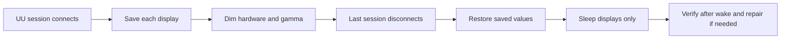

# UU Remote Brightness Guard

[简体中文](README.md)

[](https://github.com/zpmdd/uuremote-brightness-guard/actions/workflows/test.yml)
[](LICENSE)
[](#requirements)

A small macOS LaunchAgent that automatically dims every display when this Mac becomes the controlled side of a UU Remote session. After the last session disconnects, it restores each display's previous brightness and then sleeps the displays without sleeping the Mac.

> This project directly controls display brightness and gamma. Read [Safety and recovery](#safety-and-recovery) before enabling it, especially if you use external DDC/CI monitors.

## Recent fixes (2026-09-25, not yet released)

- Recognizes UU Remote 4.41.2's renamed display-sleep assertion while retaining the older name, fixing false disconnects and repeated brightness/display-sleep cycles during an active session.
- Includes cancellable post-disconnect sleep, bounded post-wake verification/repair, and protection against external-display zero snapshots captured immediately after wake.
- Three local connect/disconnect/reconnect cycles passed: all three displays dimmed, restored, slept, and woke correctly, without recurring flicker or permission dialogs. This does not validate every system and display configuration.

The fixes are on [`fix/cancelable-display-sleep`](https://github.com/zpmdd/uuremote-brightness-guard/tree/fix/cancelable-display-sleep); existing Release ZIPs do not contain these unreleased changes. See [CHANGELOG.md](CHANGELOG.md) for details.

## Features

- Treats a session as connected only when macOS records `UURemoteServer` starting real screen capture; background network and display-sleep-prevention activity cannot trigger dimming.
- Saves brightness separately for the built-in display and every external display.
- Dims external monitors to hardware 0% through DDC/CI, then holds their gamma at 0 for a near-black physical output.
- Restores the captured values after the final session disconnects, with a two-second debounce for connection glitches.
- Uses the same external display's last reliable value when its original brightness is unreadable or a wake-time zero is suspect. Without a reliable value, it uses MonitorControl-style 85%, mapped to 70% raw DDC in the tested setup. Unreadable built-in brightness still falls back to 85%.
- When MonitorControl is installed and running, pauses it only while brightness is being changed, preventing its synchronization loop from overwriting per-display values.
- Handles stale state after a Mac or monitor restart and retries a failed restore.
- Waits five seconds after a successful disconnect restore before sleeping only the displays; a new UU session cancels the sleep. After wake, it verifies hardware brightness and gamma and reapplies the snapshot once if needed.
- Runs locally, without `sudo`, accounts, cloud services, or network requests.


```mermaid
flowchart LR
    A[UU session connects] --> B[Save each display]
    B --> C[Dim hardware and gamma]
    C --> D[Last session disconnects]
    D --> E[Restore saved values]
    E --> F[Sleep displays only]
    F --> G[Verify after wake and repair if needed]
```

## Requirements

- An Apple Silicon Mac. Intel Macs are not supported by the current DDC service discovery code.
- [UU Remote](https://uuyc.163.com/) installed as `/Applications/UURemote.app`.
- [MonitorControl](https://github.com/MonitorControl/MonitorControl) is optional for a built-in-display-only Mac. It is strongly recommended with external displays so you can verify DDC/CI support and recover brightness manually if needed.
- External monitors with DDC/CI enabled. Some docks, adapters, or monitor inputs may block DDC/CI.
- Xcode Command Line Tools, used once to compile the local Swift helper. Install them with `xcode-select --install`.

The current version was validated on Apple Silicon with macOS 26.5.2, UU Remote 4.41.2, MonitorControl 4.3.3, one built-in display, and two Dell U2720QM displays; UU 4.39.0 was validated previously. Other versions and display topologies are currently unverified.

## Quick start

### Download and double-click

1. Download [UURemoteBrightnessGuard.zip](https://github.com/zpmdd/uuremote-brightness-guard/releases/latest/download/UURemoteBrightnessGuard.zip) from the latest release and extract it.
2. Make sure UU Remote is in `/Applications`. If you use external displays, installing MonitorControl is strongly recommended.
3. Double-click `Install.command`. If macOS blocks it, right-click the file and choose **Open**, or use the Terminal method below.

### Terminal

```bash
git clone https://github.com/zpmdd/uuremote-brightness-guard.git
cd uuremote-brightness-guard
./install.sh
```

Installation is per-user and does not require administrator access. The runtime is copied to:

```text
~/Library/Application Support/UURemoteBrightnessGuard
```

The downloaded source folder can be moved or deleted after installation. Open the installed folder in Finder to use `Status.command`, `Restore.command`, or `Uninstall.command`.

## Installed controls

| Control | Purpose |
| --- | --- |
| `Status.command` | Show active UU sessions, brightness state, LaunchAgent state, and the latest local events. |
| `Restore.command` | Stop the guard briefly, restore the saved values or the 85%/70% fallback, then re-enable it. |
| `Uninstall.command` | Restore first when necessary, unload the agent, and remove the installed runtime. |

The LaunchAgent label is `io.github.zpmdd.uuremote-brightness-guard`. Logs are stored in `~/Library/Logs/UURemoteBrightnessGuard`. Uninstall keeps logs by default; `./uninstall.sh --purge` removes them too.

## Safety and recovery

Before relying on the guard, confirm that MonitorControl can change every external monitor through DDC/CI. Test one connect/disconnect cycle while you can still access the Mac locally.

If a monitor stays dark after a crash, restart, or topology change:

1. Wake the displays with a key or mouse movement.
2. Open `~/Library/Application Support/UURemoteBrightnessGuard` in Finder.
3. Run `Restore.command`. It restores the saved snapshot when available; otherwise it applies the 85% built-in / 70% raw-DDC fallback.

You can also run:

```bash
"$HOME/Library/Application Support/UURemoteBrightnessGuard/restore.sh"
```

Do not disconnect, power-cycle, or rearrange monitors while testing an active dimmed session unless you have another way to reach the Mac. The project uses private macOS display APIs, so a future macOS update may require changes.

## How it works

The Python guard follows the ScreenCaptureKit `SCStream` lifecycle recorded by macOS. Dimming starts only after a `UURemoteServer` capture object starts, and disconnect is reported only after every capture stream stops. Ordinary UDP/TCP traffic and UU's own background sleep-prevention activity cannot trigger dimming. macOS power assertions are used only as a negative safety check: a missing assertion, a stopped listener, or a persistently unreadable state can restore brightness but can never start dimming. MonitorControl is not called to change brightness; when present, its process is paused briefly only to avoid conflicting writes.

Session checks and the final pre-sleep check share one parser. It only matches `UURemoteServer`'s `PreventUserIdleDisplaySleep`, accepting both the older `idleDisplaySleepDisabled` and UU 4.41.2's `UURemote Disable Display Sleep`. `Wake Up Display`, the main app's system-sleep assertion, and other applications' assertions are not session evidence.

The Swift helper uses:

- `DisplayServices` for built-in display brightness;
- DDC/CI VCP code `0x10` for external hardware brightness;
- CoreGraphics gamma tables for the final near-black output and exact gamma restoration.

Before saving a new snapshot, a zero or unreadable external brightness receives one additional read after 120 milliseconds if the displays just woke (within four seconds by default), are still asleep, or their wake state is unknown. Without a valid nonzero re-read, the guard uses the same display's reliable record or the existing fallback. This happens before dimming, and restoration and verification consume the same protected snapshot, preventing a bad zero target from being restored and then falsely accepted as success. A deliberate minimum brightness captured outside the wake window remains valid; zero is not globally replaced with 85%.

Reliable records are matched by transient IOKit identity within the same Mac boot, never by display order. A reboot, an unrecognized identity after reconnection, or a changed DDC maximum invalidates reuse. This is not an idle brightness-writing task and does not override manual adjustments while idle.

When display sleep is enabled, the guard retains the snapshot and listens for macOS display sleep/wake events. It first waits five seconds after restoration; a new UU session cancels that wait, and the guard checks again that UU is disconnected immediately before sleeping the displays. After the displays remain awake for four seconds, it reads built-in brightness, external DDC values, and external gamma tables. If a brief wake ends in sleep again, it cancels that check and keeps the snapshot for the next wake instead of treating sleeping-display read failures as brightness mismatches.

During wake verification, the guard briefly pauses MonitorControl to reduce concurrent access and accepts only DDC replies matching its brightness query. A mismatch receives at most one snapshot reapplication and recheck; a persistent mismatch stops automatic writes so manual control takes over. Verification compares hardware-reported values and gamma, not physical light output, so initial acceptance still requires observing the displays. Logs include each target's requested value, observed value, and failure details to help diagnose a correct percentage with a dim picture.

The snapshot, state, and `ddc-last-good.json` reliable-record files use mode `0600` and contain brightness values, transient display identifiers, and boot time only. They do not store display names, serial numbers, UU accounts, remote device IDs, or network addresses. Without display sleep the session snapshot is deleted after restoration; with display sleep it is deleted after post-wake verification completes or one repair still does not match. The separate reliable record remains for later sessions but is never reused across Mac boots.

## Configuration

Defaults live in `launchd/io.github.zpmdd.uuremote-brightness-guard.plist`:

| Variable | Default | Meaning |
| --- | ---: | --- |
| `UURBG_DIM_FACTOR` | `0.0` | Gamma factor during a remote session. |
| `UURBG_DISCONNECT_GRACE` | `2.0` | Seconds to wait before restore after the last disconnect. |
| `UURBG_FALLBACK` | `0.85` | Built-in/combined fallback when the original value is unavailable. |
| `UURBG_DDC_FALLBACK` | `0.70` | Raw external DDC fallback corresponding to combined 85% in the tested MonitorControl setup. |
| `UURBG_SLEEP_AFTER_DISCONNECT` | `true` | Sleep displays after a successful disconnect restore. |
| `UURBG_DISPLAY_SLEEP_DELAY` | `5.0` | Delay after restore before display sleep; a new UU session cancels it. |
| `UURBG_POST_WAKE_DELAY` | `4.0` | Wake settling window: protect suspect zeros in new snapshots during it, and verify restoration after it. |

Advanced users can edit these string values in the template and rerun `./install.sh`. Values are clamped by the guard where appropriate.

## Development

```bash
make lint
make test
make build
```

The display helper uses macOS private frameworks and is compiled locally rather than committed as an unsigned binary. Pull requests are welcome; see [CONTRIBUTING.md](CONTRIBUTING.md).

Validation on 2026-09-25 passed 30 Python tests, hardware-free DDC reply/wake snapshot checks, and LaunchAgent rendering checks. Regressions cover both assertion names, unrelated owners/types/names, keeping active captures connected without sleeping displays, and allowing sleep after a real disconnect. Hardware acceptance still requires local assistance to check reconnection and actual display brightness, not just software percentages.

## Limitations

- Apple Silicon only in the current release.
- UU Remote does not publish an API for inbound sessions. Changes to its ScreenCaptureKit events or display-sleep assertion can cause missed sessions or false disconnects followed by restoration/display sleep. Repeat connect/disconnect/reconnect acceptance after UU updates. If issues recur, stop testing and pause the guard for diagnosis; do not approve batches of recording-permission dialogs. `Restore.command` re-enables the guard and is not a persistent pause control.
- If the guard restarts in the middle of a remote session, it prioritizes restoring brightness and waits for the next connection instead of replaying historical events to dim again.
- DDC/CI behavior depends on the monitor, input, cable, dock, and macOS release.
- External displays are matched by the runtime topology/slot order because the low-level service does not expose a stable public identifier.
- MonitorControl is not required for a built-in-only setup. External-display use without it is possible but has less convenient compatibility testing and manual recovery.
- This is an independent utility, not an official UU Remote or MonitorControl feature.

## License and acknowledgements

This project is licensed under the [MIT License](LICENSE).

The DDC implementation follows ideas and patterns from the MIT-licensed [MonitorControl](https://github.com/MonitorControl/MonitorControl) project. See [THIRD_PARTY_NOTICES.md](THIRD_PARTY_NOTICES.md) and [LICENSE-MonitorControl.txt](LICENSE-MonitorControl.txt).
