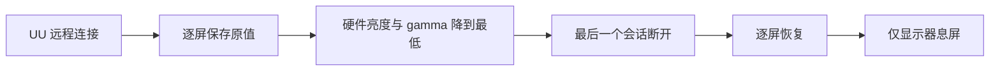

# UU 远程亮度守护

[English](README.md)

[](https://github.com/zpmdd/uuremote-brightness-guard/actions/workflows/test.yml)
[](LICENSE)
[](#运行要求)

一个小型 macOS LaunchAgent：当本机成为 UU 远程被控端时，自动保存每块显示器的亮度并降到最低；最后一个远程会话断开后，逐屏恢复原亮度，再只让显示器息屏，Mac 本身继续运行。

> 本项目会直接控制显示器硬件亮度和 gamma。启用前请先阅读[安全与恢复](#安全与恢复)，使用 DDC/CI 外接屏时尤其重要。

## 功能

- 从本机 UU 服务日志识别真实的远程连接和断开事件。
- 分别保存内置屏幕及每块外接屏的亮度。
- 外接屏先通过 DDC/CI 降到硬件 0%，再持续把 gamma 保持为 0，得到接近全黑的物理输出。
- 最后一个会话断开 2 秒后恢复各屏原值，避免短暂网络抖动造成反复闪屏。
- 某块屏幕读不到原值时，采用 MonitorControl 页面意义上的 85% 兜底；在已验证配置中，外接屏对应原始 DDC 70%。
- 如果已安装且正在运行 MonitorControl，调整期间会暂时挂起它，避免其同步线程覆盖逐屏值。
- 能识别 Mac 或显示器重启后的旧状态，并持续重试未成功的恢复。
- 恢复成功 1 秒后仅调用显示器休眠；键盘或鼠标唤醒后仍是恢复后的亮度。
- 完全本地运行，不需要 `sudo`、账号、云服务或网络请求。



## 运行要求

- Apple Silicon Mac。当前 DDC 服务发现方式暂不支持 Intel Mac。
- [UU 远程](https://uuyc.163.com/) 位于 `/Applications/UURemote.app`。
- 只有内置屏的 Mac 不需要安装 [MonitorControl](https://github.com/MonitorControl/MonitorControl)。使用外接屏时强烈建议安装，以便验证 DDC/CI 兼容性，并在必要时手动恢复亮度。
- 外接显示器已启用 DDC/CI；部分扩展坞、转接器或显示器输入口可能不透传 DDC/CI。
- Xcode Command Line Tools，仅在安装时用于本机编译 Swift 辅助工具；可运行 `xcode-select --install` 安装。

首个版本已在 Apple Silicon、macOS 26.5.2、UU 远程 4.34.0、MonitorControl 4.3.3、一块内置屏和两块 Dell U2720QM 上验证。其他系统版本和显示器组合目前未验证。

## 快速安装

### 下载后双击

1. 从最新版本下载并解压 [UURemoteBrightnessGuard.zip](https://github.com/zpmdd/uuremote-brightness-guard/releases/latest/download/UURemoteBrightnessGuard.zip)。
2. 确认 UU 远程位于 `/Applications`；如使用外接屏，强烈建议同时安装 MonitorControl。
3. 双击 `Install.command`。如果 macOS 阻止运行，请右键文件选择“打开”，或改用下面的终端方式。

### 终端安装

```bash
git clone https://github.com/zpmdd/uuremote-brightness-guard.git
cd uuremote-brightness-guard
./install.sh
```

安装仅针对当前用户，不需要管理员权限。运行文件会被复制到：

```text
~/Library/Application Support/UURemoteBrightnessGuard
```

安装完成后，下载的源码目录可以移动或删除。使用 Finder 打开上述安装目录，即可运行 `Status.command`、`Restore.command` 或 `Uninstall.command`。

## 已安装的控制入口

| 入口 | 用途 |
| --- | --- |
| `Status.command` | 查看 UU 活跃会话、亮度状态、LaunchAgent 状态及最近事件。 |
| `Restore.command` | 暂停守护，恢复已保存的原值；没有快照时采用内屏 85% / 外屏原始 DDC 70% 兜底，随后重新启用守护。 |
| `Uninstall.command` | 必要时先恢复亮度，再卸载服务并删除运行文件。 |

LaunchAgent 名称为 `io.github.zpmdd.uuremote-brightness-guard`。日志位于 `~/Library/Logs/UURemoteBrightnessGuard`。普通卸载会保留日志；运行 `./uninstall.sh --purge` 可一并删除。

## 安全与恢复

正式使用前，请先确认 MonitorControl 能通过 DDC/CI 调整所有外接屏，并在能够本地操作 Mac 的情况下完成一次连接、断开测试。

如果崩溃、重启或显示器拓扑变化后仍有屏幕保持黑暗：

1. 用键盘或鼠标唤醒显示器。
2. 在 Finder 中打开 `~/Library/Application Support/UURemoteBrightnessGuard`。
3. 运行 `Restore.command`。存在快照时恢复原值；没有快照时使用内屏 85% / 外屏原始 DDC 70% 兜底。

也可在终端运行：

```bash
"$HOME/Library/Application Support/UURemoteBrightnessGuard/restore.sh"
```

首次测试远程变暗期间，不要随意断开、重启或重新排列显示器，除非你还有其他方式进入 Mac。本项目使用 macOS 私有显示接口，未来系统升级可能需要适配。

## 工作原理

Python 守护程序持续读取本机 `UURemoteServer.log`，按会话句柄跟踪 `peerConnected` / `disconnected` 状态，并忽略上次开机或上一个 UU 服务进程留下的旧事件。亮度调整并不调用 MonitorControl；它存在时只会被短暂挂起，以避免同时写入产生冲突。

Swift 辅助工具使用：

- `DisplayServices` 控制内置屏幕亮度；
- DDC/CI VCP `0x10` 控制外接屏硬件亮度；
- CoreGraphics gamma 表实现最后一级近乎全黑的输出，并在断开后精确恢复 gamma。

快照和状态文件权限为 `0600`，只保存亮度值和临时显示器标识，不保存显示器名称、序列号、UU 账号、远端设备 ID 或网络地址。恢复成功后会自动删除亮度快照。

## 配置

默认值位于 `launchd/io.github.zpmdd.uuremote-brightness-guard.plist`：

| 变量 | 默认值 | 含义 |
| --- | ---: | --- |
| `UURBG_DIM_FACTOR` | `0.0` | 远控期间的 gamma 系数。 |
| `UURBG_DISCONNECT_GRACE` | `2.0` | 最后断开后等待恢复的秒数。 |
| `UURBG_FALLBACK` | `0.85` | 无法读取原值时的内屏/组合亮度兜底。 |
| `UURBG_DDC_FALLBACK` | `0.70` | 已验证 MonitorControl 配置中，对应组合亮度 85% 的外接屏原始 DDC 值。 |
| `UURBG_SLEEP_AFTER_DISCONNECT` | `true` | 恢复成功后是否让显示器息屏。 |
| `UURBG_DISPLAY_SLEEP_DELAY` | `1.0` | 调用 `pmset displaysleepnow` 前的延时。 |

高级用户可以修改模板中的字符串值，再运行 `./install.sh` 重新安装；守护程序会按范围校正数值。

## 开发与验证

```bash
make lint
make test
make build
```

显示器辅助工具依赖 macOS 私有框架，因此项目选择在用户本机编译，不提交未签名的二进制文件。欢迎提交改进，详见 [CONTRIBUTING.md](CONTRIBUTING.md)。

## 已知限制

- 当前版本仅支持 Apple Silicon。
- UU 远程日志格式不是公开 API，后续版本可能变化。
- DDC/CI 是否可用取决于显示器、输入口、线缆、扩展坞和 macOS 版本。
- 底层服务没有稳定的公开显示器标识，因此外接屏按当前拓扑/槽位顺序匹配。
- 只有内置屏时不需要 MonitorControl；有外接屏时也能独立运行，但兼容性验证和手动恢复会不够方便。
- 本项目是独立工具，不是 UU 远程或 MonitorControl 官方功能。

## 许可与致谢

本项目采用 [MIT License](LICENSE)。

DDC 实现参考了 MIT 许可的 [MonitorControl](https://github.com/MonitorControl/MonitorControl) 项目，详见 [THIRD_PARTY_NOTICES.md](THIRD_PARTY_NOTICES.md) 和 [LICENSE-MonitorControl.txt](LICENSE-MonitorControl.txt)。
